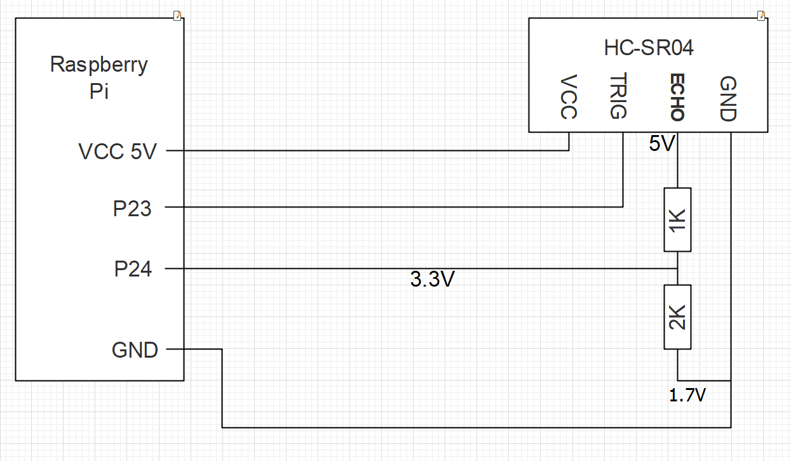
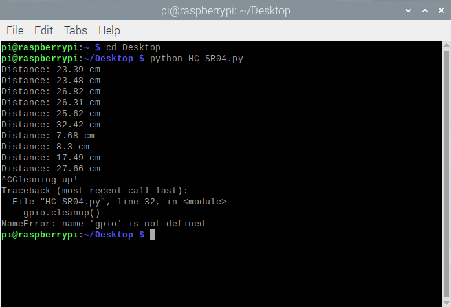
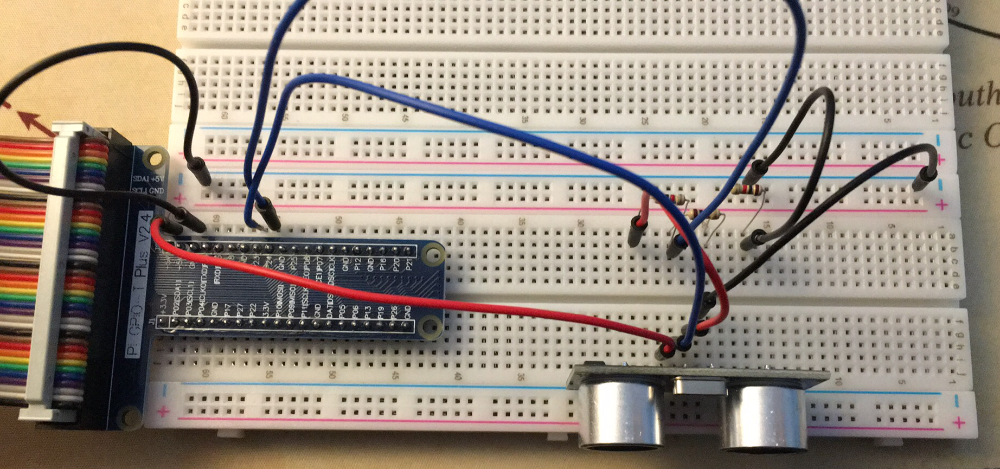

# HC-SR04 Ultrasonic distance sensor

Ultrasonic ranging module HC-SR04 provides 2cm - 400cm non-contact
measurement function, the ranging accuracy can reach to 3mm.

## Needed Components

- RaspberryPi (my model RPi 4 4gb)
- HC-SR04
- 1K resistor (I used 3 resistor 1K)
- 2K resistor
- few wires

## Needed Software

- RaspberryPi Raspbian
- my script HC-SR04.py

## Python script (HC-SR04.py)

```python
import RPi.GPIO as GPIO
import time
GPIO.setmode(GPIO.BCM)
GPIO.setwarnings(False)

TRIG = 23
ECHO = 24

GPIO.setup(TRIG, GPIO.OUT)
GPIO.setup(ECHO, GPIO.IN)
try:
    while True:
        
        GPIO.output(TRIG, True)
        time.sleep(0.5)
        GPIO.output(TRIG, False)
        
        while GPIO.input(ECHO)==0:
            pulse_start = time.time()
            
        while GPIO.input(ECHO)==1:
            pulse_end = time.time()
            
        pulse_duration = pulse_end - pulse_start
        distance = pulse_duration * 17150
        distance = round(distance, 2)
        
        print "Distance:", distance, "cm"
        
except KeyboardInterrupt:
    print "Cleaning up!"
    gpio.cleanup()
```
## Scheme


## Result


## CircuitView


## License
[MIT](https://choosealicense.com/licenses/mit/)